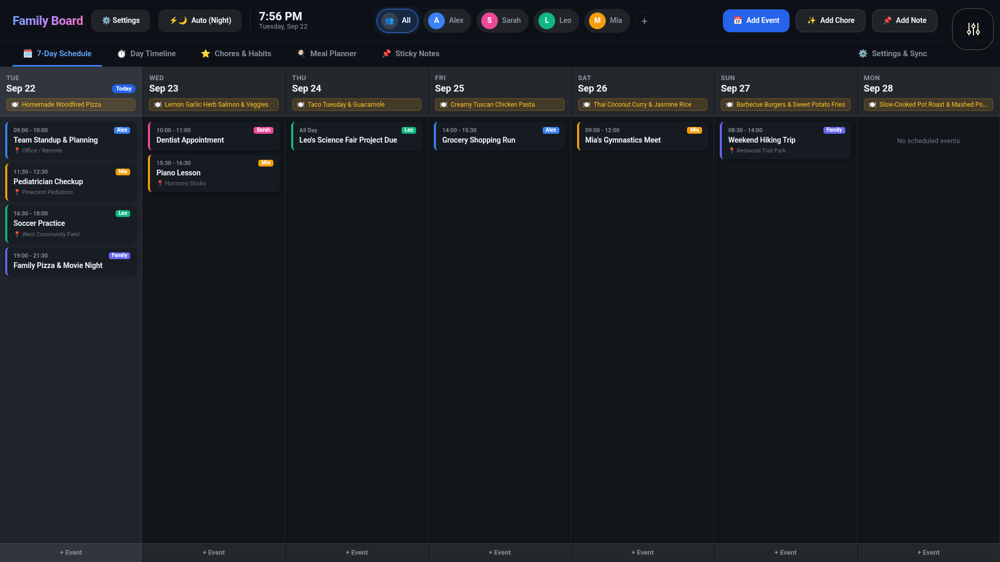
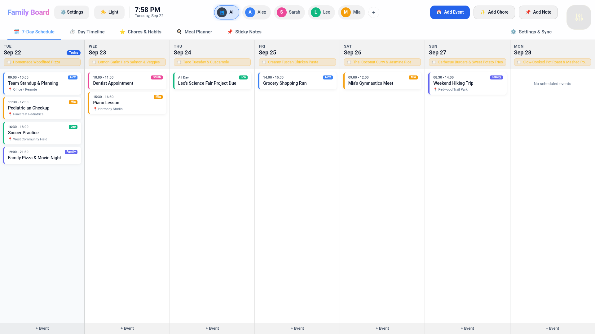
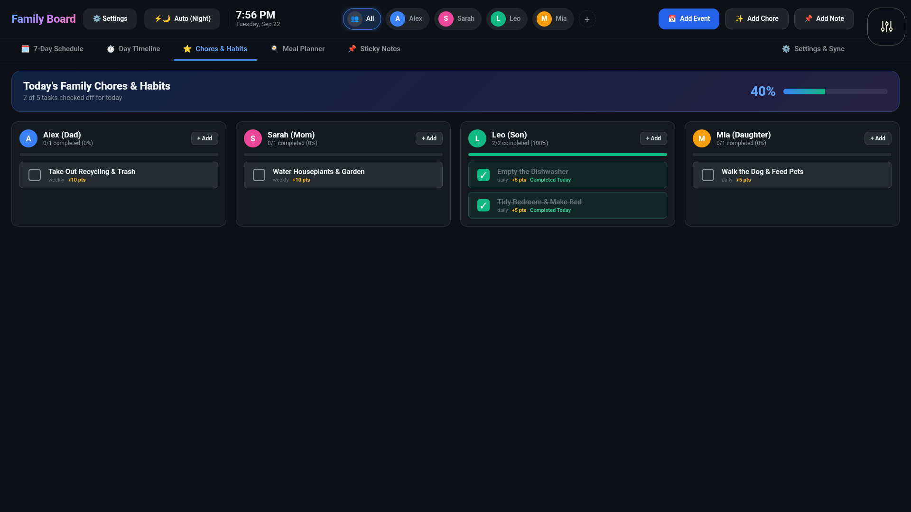
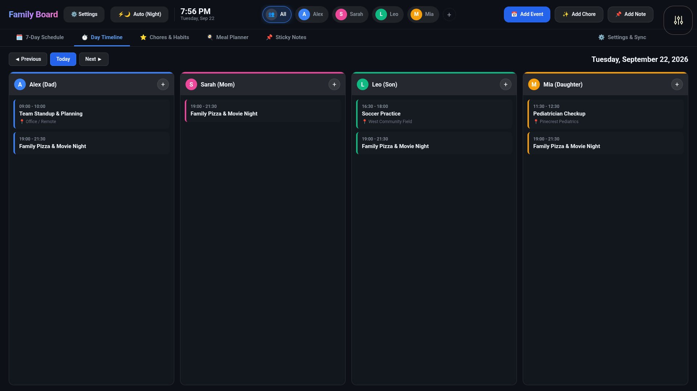
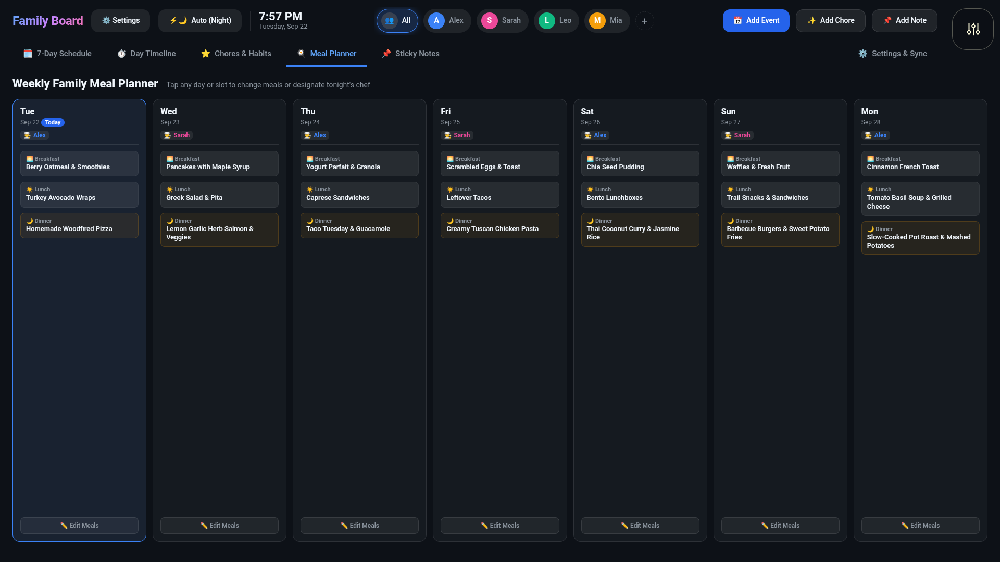

# BaseBoard
A Family Calendar for board.fun

## How To Install
1. Download the baseboard.webapp.zip
2. On Board, open Settings > System > Pair a computer > Show pairing code. Board’s web address will be listed.
3. Browse to http://BoardIP:8843/ then enter the six-digit code in the browser.
4. Click "Install app" and upload the baseboard.webapp.zip file.

